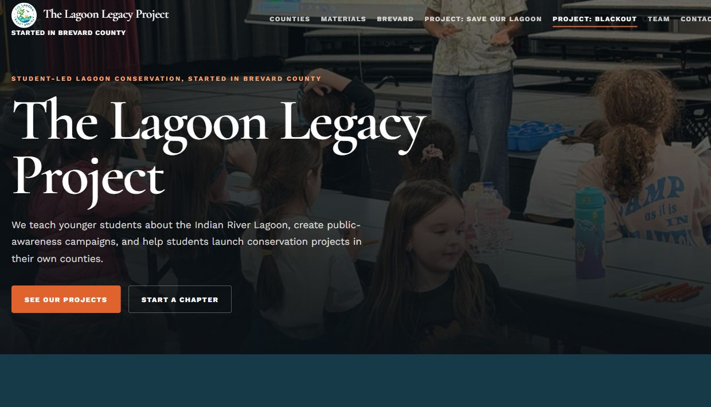

# The Lagoon Legacy Project

A website for student-led conservation and environmental education around the Indian River Lagoon.

[Visit the website](https://thelagoonlegacyproject.vercel.app)

## About the project

The Lagoon Legacy Project brings classroom lessons, public-awareness campaigns, and county chapters together. The website gives visitors a place to learn about the work, find a local chapter, explore teaching materials, and get involved.

## My work

I built the site's shared design and navigation, county chapter pages, searchable team directory, and contact and chapter-application forms. The pages connect the organization's projects, people, photographs, and resources in one place.

## Website guide

The [website guide](WEBSITE_GUIDE.md) explains how the pages and forms are maintained.
